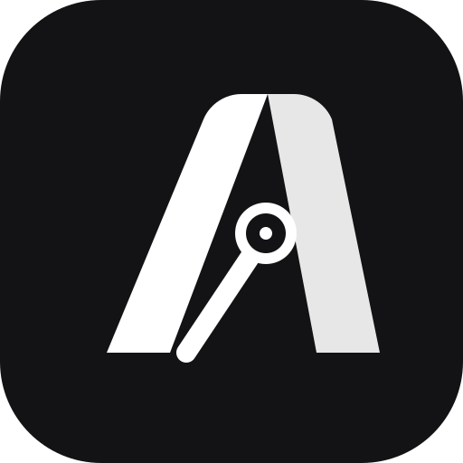
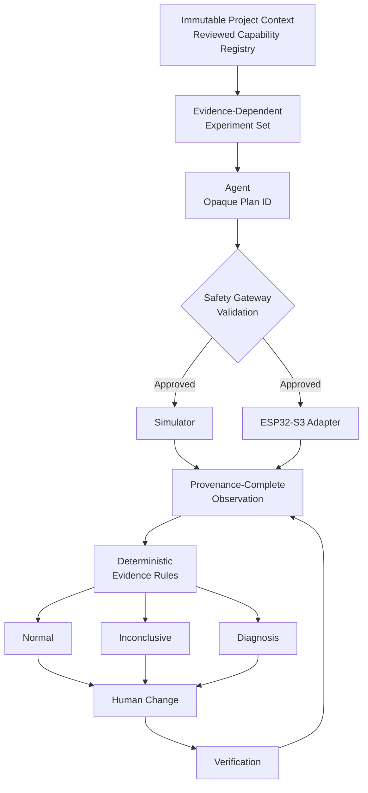

<!-- Improved compatibility of back to top link: See https://github.com/othneildrew/Best-README-Template/pull/73 -->
<a id="readme-top"></a>

<!-- PROJECT SHIELDS -->
[![Contributors][contributors-shield]][contributors-url]
[![Forks][forks-shield]][forks-url]
[![Stargazers][stars-shield]][stars-url]
[![Issues][issues-shield]][issues-url]
[![MIT License][license-shield]][license-url]
[![ESP32-S3][esp32-shield]][esp32-url]

<!-- PROJECT LOGO -->
<br />
<div align="center">
  <a href="https://github.com/Atharva-Mendhulkar/AHEA">
    
  </a>

  <h3 align="center">AHEA Hardware Agent</h3>

  <p align="center">
    Evidence-driven physical diagnostics for ESP32-S3 systems.
    <br />
    <a href="docs/architecture.md"><strong>Explore the documentation »</strong></a>
    <br />
    <br />
    <a href="#getting-started">Run the demo</a>
    &middot;
    <a href="https://github.com/Atharva-Mendhulkar/AHEA/issues/new?labels=bug">Report a bug</a>
    &middot;
    <a href="https://github.com/Atharva-Mendhulkar/AHEA/issues/new?labels=enhancement">Request a feature</a>
  </p>
</div>

<!-- TABLE OF CONTENTS -->
<details>
  <summary>Table of Contents</summary>
  <ol>
    <li>
      <a href="#about-the-project">About The Project</a>
      <ul>
        <li><a href="#how-it-works">How It Works</a></li>
        <li><a href="#built-with">Built With</a></li>
      </ul>
    </li>
    <li>
      <a href="#getting-started">Getting Started</a>
      <ul>
        <li><a href="#prerequisites">Prerequisites</a></li>
        <li><a href="#installation">Installation</a></li>
      </ul>
    </li>
    <li>
      <a href="#usage">Usage</a>
      <ul>
        <li><a href="#simulation">Simulation</a></li>
        <li><a href="#physical-hardware">Physical Hardware</a></li>
        <li><a href="#commands">Commands</a></li>
      </ul>
    </li>
    <li><a href="#safety-and-trust-boundaries">Safety and Trust Boundaries</a></li>
    <li><a href="#api">API</a></li>
    <li><a href="#roadmap">Roadmap</a></li>
    <li><a href="#contributing">Contributing</a></li>
    <li><a href="#license">License</a></li>
    <li><a href="#contact">Contact</a></li>
    <li><a href="#acknowledgments">Acknowledgments</a></li>
  </ol>
</details>

<!-- ABOUT THE PROJECT -->
## About The Project

AHEA is an open-source, ESP32-S3-centered framework for evidence-driven diagnostics of physical computing systems. An agent selects from backend-offered semantic experiments, while reviewed firmware and a safety gateway retain control over pins, timing, electrical limits, and cleanup. Deterministic rules, not the language model, decide what the resulting measurements support.

The MVP proves this architecture using a protected waveform loopback with separate source and destination observers. HC-SR04, MPU6050, and DHT11 profiles demonstrate how the same capability, provenance, evidence, and lifecycle interfaces extend to optional sensors.

AHEA is designed to reach an evidence-supported diagnosis or explicitly report that the available evidence is inconclusive. It does not claim autonomous root-cause discovery or laboratory-grade measurement.

Read the [product requirements](prd.md), [architecture](docs/architecture.md), and [safety model](docs/safety.md) for the complete design contract.

<p align="right">(<a href="#readme-top">back to top</a>)</p>

### How It Works



The required physical proof uses this protected 3.3 V fixture:

<p align="center">
  
</p>

The registered initial plan generates a 1 kHz, 50% duty-cycle waveform for 500 ms. Because the same ESP32-S3 generates and observes it, the result establishes internal timing consistency, not independent calibration.

<p align="right">(<a href="#readme-top">back to top</a>)</p>

### Built With

* [![Node.js][node-shield]][node-url]
* [![TypeScript][typescript-shield]][typescript-url]
* [![Express][express-shield]][express-url]
* [![Zod][zod-shield]][zod-url]
* [![OpenAI][openai-shield]][openai-url]
* [![PlatformIO][platformio-shield]][platformio-url]
* [![Arduino][arduino-shield]][arduino-url]
* [![Vitest][vitest-shield]][vitest-url]

<p align="right">(<a href="#readme-top">back to top</a>)</p>

<!-- GETTING STARTED -->
## Getting Started

Simulation is the default and requires no attached hardware. It exercises the full investigation, evidence, provenance, intervention, and verification flow without making physical claims.

### Prerequisites

* [Node.js][node-url] 22 or newer
* npm 10 or newer
* [PlatformIO Core][platformio-url] for firmware builds and tests
* An ESP32-S3 N16R8 board only when following the physical bring-up guide

### Installation

1. Clone the repository:

   ```sh
   git clone https://github.com/Atharva-Mendhulkar/AHEA.git
   cd AHEA
   ```

2. Install the Node.js dependencies:

   ```sh
   npm install
   ```

3. Optionally provide an OpenAI API key. Without one, AHEA uses its deterministic selector:

   ```sh
   export OPENAI_API_KEY="your-api-key"
   ```

4. Start the development server:

   ```sh
   npm run dev
   ```

5. Open [http://localhost:3000](http://localhost:3000).

<p align="right">(<a href="#readme-top">back to top</a>)</p>

<!-- USAGE EXAMPLES -->
## Usage

### Simulation

Simulation is the safest way to learn the complete diagnostic lifecycle. It uses seeded, profile-specific physical models or exact replay of an imported physical report. It preserves the same capability registry and evidence boundaries as physical mode and never makes a physical claim.

1. Run the software readiness checks and start the server:

   ```sh
   npm run check
   npm run dev
   ```

2. Open [http://localhost:3000](http://localhost:3000).
3. Select a profile:
   * **Core loopback** exercises adaptive path diagnosis, intervention, and verification.
   * **HC-SR04**, **MPU6050**, and **DHT11** exercise each sensor's registered characterization plans.
4. Select **Simulation** as the evidence source.
5. Select **Generated model** or **Physical capture replay**. Generated mode accepts a reproducible session seed and bounded semantic controls for the selected profile. Replay lists only locally imported physical reports for that profile.
6. Select a generated condition such as normal, open path, noisy, timeout, or sensor fault. Optional controls set distance, motion amplitude, temperature, or humidity within API-enforced bounds.
7. Describe the reported problem and select **Create evidence session**. The backend freezes the project context, resolves the simulation specification, validates the simulator registry, and records the model, scenario, calibration, registry, and context digests.
8. Let automatic capture run, or pause it to inspect each operator prompt. The simulator waits four seconds before each bounded plan. Optional sensor prompts describe a scripted stimulus; no real motion, distance, temperature, or humidity is sensed.
9. Review each observation, generated or replayed series, hypothesis, confidence label, provenance, and timeline event. AHEA chooses the next registered experiment from the evidence state:
   * Loopback starts at the destination, checks the source when needed, compares endpoints, and runs a bounded repeat when evidence conflicts.
   * Sensor profiles run identity or response, baseline, and consistency or motion plans in their registered order.
10. Follow the terminal path:
   * Normal bounded behavior ends at `CONCLUDED_NORMAL`.
   * Unsupported or conflicting evidence ends at `INCONCLUSIVE`.
   * A supported loopback fault reaches `DIAGNOSIS_READY` and exposes one evidence-linked intervention.
11. For `DIAGNOSIS_READY`, review the recommendation, enter the simulated human change, confirm the safety procedure, and declare the intervention. AHEA then runs the registered verification plan twice.
12. Two simulated passes produce `SIMULATED_PASS` and an `INCONCLUSIVE` lifecycle because simulation cannot produce physical `CONFIRMED` status. A failed pass produces `FAILED_VERIFICATION`.
13. Select **Download report** to retain the JSON report with observations, provenance, decisions, limitations, intervention, verification counters, and timing.

See [the simulation and calibration guide](docs/simulation.md) for capture import, replay, model calibration, and validation.

Use **Stop** at any point to abort the active operation, apply registered cleanup, and end the session as `ESTOPPED`. Monitoring samples, when available, are provenance-tagged but excluded from diagnostic evidence.

### Physical Hardware

Physical mode is fail-closed. In the current repository, only the dedicated MPU6050 environment is enabled with a reviewed physical profile. The default loopback build, HC-SR04 profile, and DHT11 profile remain safe-disabled and must not be used for physical sessions until their electrical interfaces and matching profile identities are reviewed.

1. Complete the software and firmware readiness checks:

   ```sh
   npm run check
   npm run firmware:test
   npm run firmware:build
   npm run firmware:build:mpu6050
   ```

2. Disconnect power before wiring the MPU6050. Use this exact reviewed mapping:

   | MPU6050 | ESP32-S3 |
   |---|---|
   | VCC | 3.3 V |
   | GND | GND |
   | SDA | GPIO14 |
   | SCL | GPIO13 |
   | AD0 | GND for address `0x68` |
   | INT, XDA, XCL | Not connected |

   Confirm that all I2C pull-ups terminate at 3.3 V. The module power LED proves only that power is present; it does not prove I2C communication.

3. Connect the ESP32-S3 through its CP2102 USB serial interface and identify the port. The following commands use the currently detected macOS path; substitute the actual port on another system:

   ```sh
   ls /dev/cu.usbserial-*
   ```

4. Flash the reviewed MPU6050 build:

   ```sh
   .venv/bin/pio run -d firmware \
     -e esp32s3_mpu6050 \
     -t upload \
     --upload-port /dev/cu.usbserial-0001
   ```

5. Run the bounded identity smoke test:

   ```sh
   npm run firmware:smoke:mpu6050 -- /dev/cu.usbserial-0001
   ```

   Continue only when the handshake reports the expected board, protocol, reviewed profile, and registry digest, and the result contains `"identityValid": true` with an accepted operation and healthy target. If identity is false, power down and check 3.3 V, common ground, SDA and SCL orientation, GPIO14 and GPIO13 placement, AD0, and the `0x68` address before retrying.

6. Start the backend with both physical gates:

   ```sh
   AHEA_PHYSICAL_ENABLED=true \
   AHEA_SERIAL_PATH=/dev/cu.usbserial-0001 \
   npm run dev
   ```

7. Open [http://localhost:3000](http://localhost:3000), select **MPU6050**, select **Physical**, describe the problem, and select **Create evidence session**.
8. Session creation performs a physical preflight and arms the firmware. It rejects a disabled profile, latched emergency stop, unsafe cleanup state, protocol mismatch, board or profile mismatch, stale registry digest, altered plan, binding mismatch, or measurement-schema mismatch.
9. Select **Start investigation**. Physical mode never executes automatically.
10. Complete and confirm every displayed operator action before selecting **Action complete, capture data**:
    * Identity: leave the powered I2C wiring unchanged while `WHO_AM_I` is checked.
    * Stationary baseline: place the MPU6050 on a stable surface and do not move it during capture.
    * Motion and axes: perform only the displayed single-axis movement during the capture window.
11. After each operation, confirm that the dashboard shows accepted execution, valid provenance, successful cleanup, healthy target status, and measurements within the declared bounds. AHEA then selects the next registered plan.
12. The current MPU6050 workflow finishes as `CONCLUDED_NORMAL` when all three registered plans satisfy their bounds, or `INCONCLUSIVE` when identity, noise, drift, motion, axis response, operation health, or provenance cannot support a bounded normal conclusion. It does not claim orientation or calibration accuracy without an independent reference.
13. Select **Download report** and retain the full physical record. Use **Stop** immediately if wiring changes, unexpected behavior, or an unsafe condition occurs.

The full repair and confirmation lifecycle applies when a reviewed physical profile exposes an evidence-supported intervention and verification plan. The operator must power down, perform the recommended change, declare exactly what changed, confirm the safety procedure, and run the unchanged registered verification plan until it passes twice consecutively. Only two consecutive physical passes can produce `CONFIRMED`; the first failure produces `FAILED_VERIFICATION`. The current MPU6050 profile is characterization-only, and the repository's loopback profile must remain in simulation until a separate reviewed physical loopback profile is added.

Every physical report should retain the firmware, board, protocol, and profile identities; registry and project-context digests; setup declarations; raw observations; gateway decisions; cleanup status; intervention declaration when applicable; verification results; and stated limitations. Continue with the [physical bring-up guide](docs/hardware-bringup.md) and [acceptance-readiness checklist](docs/physical-readiness.md) before enabling any additional hardware profile.

### Commands

| Command | Purpose |
|---|---|
| `npm run dev` | Start the TypeScript server in watch mode |
| `npm start` | Start the server without watch mode |
| `npm run build` | Type-check and compile the application |
| `npm test` | Run deterministic software tests |
| `npm run check` | Build and run the software test suite |
| `npm run test:openai` | Run the opt-in live selector test |
| `npm run firmware:test` | Run native firmware safety tests |
| `npm run firmware:build` | Build the safe-disabled ESP32-S3 firmware |
| `npm run firmware:build:mpu6050` | Build the reviewed MPU6050 physical firmware |
| `npm run firmware:smoke:mpu6050 -- <serial-port>` | Validate the physical handshake and MPU6050 identity |
| `npm run simulation:capture:import -- <report> [capture-id]` | Import a validated physical report for local replay and calibration |
| `npm run simulation:calibrate` | Derive compact model parameters when the corpus threshold is met |
| `npm run simulation:validate-models` | Validate model files and calibration claims |

<p align="right">(<a href="#readme-top">back to top</a>)</p>

<!-- SAFETY -->
## Safety and Trust Boundaries

* ESP32-S3 GPIO is 3.3 V only and is not 5 V tolerant.
* Project context is immutable within a session and attached by digest to every observation.
* The agent can select only opaque registered experiment IDs; it cannot control pins, waveforms, ADC settings, I²C bytes, or timing values.
* Firmware independently enforces reviewed plans, exact targets, timeouts, budgets, abort behavior, watchdog recovery, and output cleanup.
* The backend rejects stale or altered capability registries and mismatched firmware, board, profile, bindings, or measurement schemas.
* Evidence, confidence labels, lifecycle transitions, and verification counters are deterministic and backend-owned.
* Every physical change is performed and declared by a human.
* Physical and simulation evidence cannot be mixed.
* `CONFIRMED` requires two consecutive passing physical verification runs after a declared intervention.

AHEA is a prototype, not certified test equipment. Review [docs/safety.md](docs/safety.md) before connecting hardware.

<p align="right">(<a href="#readme-top">back to top</a>)</p>

<!-- API -->
## API

<details>
  <summary>HTTP endpoints</summary>

* `GET /api/project-contexts`
* `GET /api/project-context/default`
* `POST /api/sessions`
* `POST /api/sessions/:id/problem`
* `POST /api/sessions/:id/investigation/start`
* `POST /api/sessions/:id/investigation/advance`
* `GET /api/sessions/:id/pending-decision`
* `POST /api/sessions/:id/decisions/:decisionId/execute`
* `POST /api/sessions/:id/interventions`
* `POST /api/sessions/:id/emergency-stop`
* `GET /api/sessions/:id`
* `GET /api/sessions/:id/report`
* `GET /api/sessions/:id/events`

</details>

The ESP32-S3 transport uses strict newline-delimited JSON at 115200 baud. See the [USB serial protocol](docs/protocol.md).

<p align="right">(<a href="#readme-top">back to top</a>)</p>

<!-- ROADMAP -->
## Roadmap

- [x] Capability-first project, registry, and experiment model
- [x] Adaptive destination-first loopback simulation
- [x] Deterministic evidence, provenance, lifecycle, and verification rules
- [x] Strict firmware protocol, safety state, abort handling, timeout, watchdog, and N16R8 build
- [x] Optional HC-SR04, MPU6050, and DHT11 simulation profiles
- [ ] Review and assemble the protected GPIO4/GPIO5/GPIO6 fixture
- [ ] Retain intact-path and hidden-open-path hardware-in-loop evidence
- [ ] Verify output-low behavior after success, error, timeout, abort, disconnect, and restart
- [ ] Complete two consecutive physical post-intervention verification passes
- [ ] Validate optional profiles on separately reviewed electrical interfaces

See the [delivery roadmap](docs/roadmap.md) and [physical readiness record](docs/physical-readiness.md) for detailed exit criteria.

<p align="right">(<a href="#readme-top">back to top</a>)</p>

<!-- CONTRIBUTING -->
## Contributing

Contributions that make hardware diagnosis safer, more reproducible, or easier to understand are welcome.

1. Fork the project.
2. Create a feature branch: `git checkout -b feature/your-feature`.
3. Make the change with focused tests and documentation.
4. Run `npm run check` and, for firmware work, `npm run firmware:test` and `npm run firmware:build`.
5. Commit and push the branch.
6. Open a pull request describing any safety, evidence, provenance, or compatibility impact.

Read [CONTRIBUTING.md](CONTRIBUTING.md) before changing protocol, firmware, evidence, or lifecycle behavior.

<p align="center">
  <a href="https://github.com/Atharva-Mendhulkar/AHEA/graphs/contributors">
    
  </a>
</p>

<p align="right">(<a href="#readme-top">back to top</a>)</p>

<!-- LICENSE -->
## License

Distributed under the MIT License. See [LICENSE](LICENSE) for details.

<p align="right">(<a href="#readme-top">back to top</a>)</p>

<!-- CONTACT -->
## Contact

Project link: [github.com/Atharva-Mendhulkar/AHEA](https://github.com/Atharva-Mendhulkar/AHEA)

Issues and feature requests: [GitHub Issues](https://github.com/Atharva-Mendhulkar/AHEA/issues)

<p align="right">(<a href="#readme-top">back to top</a>)</p>

<!-- ACKNOWLEDGMENTS -->
## Acknowledgments

* [Espressif Systems](https://www.espressif.com/) for the ESP32-S3 platform
* [PlatformIO](https://platformio.org/) for embedded builds and testing
* [ArduinoJson](https://arduinojson.org/) for the firmware JSON protocol
* [Vitest](https://vitest.dev/) for deterministic application tests

<p align="right">(<a href="#readme-top">back to top</a>)</p>

<!-- MARKDOWN LINKS & IMAGES -->
[contributors-shield]: https://img.shields.io/github/contributors/Atharva-Mendhulkar/AHEA.svg?style=for-the-badge
[contributors-url]: https://github.com/Atharva-Mendhulkar/AHEA/graphs/contributors
[forks-shield]: https://img.shields.io/github/forks/Atharva-Mendhulkar/AHEA.svg?style=for-the-badge
[forks-url]: https://github.com/Atharva-Mendhulkar/AHEA/network/members
[stars-shield]: https://img.shields.io/github/stars/Atharva-Mendhulkar/AHEA.svg?style=for-the-badge
[stars-url]: https://github.com/Atharva-Mendhulkar/AHEA/stargazers
[issues-shield]: https://img.shields.io/github/issues/Atharva-Mendhulkar/AHEA.svg?style=for-the-badge
[issues-url]: https://github.com/Atharva-Mendhulkar/AHEA/issues
[license-shield]: https://img.shields.io/github/license/Atharva-Mendhulkar/AHEA.svg?style=for-the-badge
[license-url]: https://github.com/Atharva-Mendhulkar/AHEA/blob/main/LICENSE
[esp32-shield]: https://img.shields.io/badge/ESP32--S3-N16R8-E7352C?style=for-the-badge&logo=espressif&logoColor=white
[esp32-url]: https://www.espressif.com/en/products/socs/esp32-s3
[node-shield]: https://img.shields.io/badge/Node.js-22%2B-339933?style=for-the-badge&logo=nodedotjs&logoColor=white
[node-url]: https://nodejs.org/
[typescript-shield]: https://img.shields.io/badge/TypeScript-5-3178C6?style=for-the-badge&logo=typescript&logoColor=white
[typescript-url]: https://www.typescriptlang.org/
[express-shield]: https://img.shields.io/badge/Express-5-000000?style=for-the-badge&logo=express&logoColor=white
[express-url]: https://expressjs.com/
[zod-shield]: https://img.shields.io/badge/Zod-3-3E67B1?style=for-the-badge&logo=zod&logoColor=white
[zod-url]: https://zod.dev/
[openai-shield]: https://img.shields.io/badge/OpenAI-optional-412991?style=for-the-badge&logo=openai&logoColor=white
[openai-url]: https://platform.openai.com/docs/
[platformio-shield]: https://img.shields.io/badge/PlatformIO-6-F5822A?style=for-the-badge&logo=platformio&logoColor=white
[platformio-url]: https://platformio.org/
[arduino-shield]: https://img.shields.io/badge/Arduino-ESP32-00878F?style=for-the-badge&logo=arduino&logoColor=white
[arduino-url]: https://docs.espressif.com/projects/arduino-esp32/en/latest/
[vitest-shield]: https://img.shields.io/badge/Vitest-3-6E9F18?style=for-the-badge&logo=vitest&logoColor=white
[vitest-url]: https://vitest.dev/
