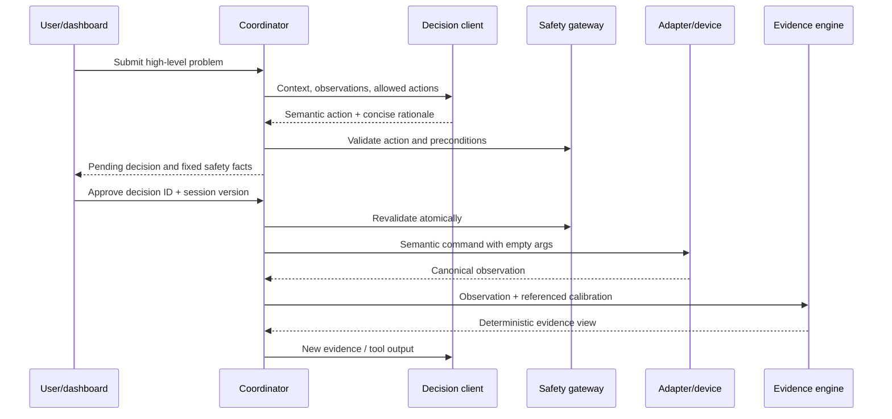

# Architecture

## Trust boundaries

The system is a modular monolith on the laptop and a separate deterministic firmware target.

1. The dashboard submits intent and approvals; it has no hardware parameter interface.
2. The coordinator owns workflow state and creates version-bound pending decisions.
3. The agent proposes one semantic action from the currently offered set.
4. The gateway checks action ordering, state, budget, e-stop, and evidence preconditions.
5. The selected adapter executes the semantic command and returns normalized facts.
6. The evidence engine derives hypothesis support and confidence without model input.
7. The coordinator records the result and requests a fresh decision.

The dashboard keeps Evidence, Hypotheses, Timeline, and Report as separate in-app views. The Evidence view animates only sample arrays carried by canonical observations; it does not fabricate physical readings in the browser.

## Runtime data flow

## State ownership

- `SETUP → READY → INVESTIGATING → AWAITING_INTERVENTION → VERIFYING → CONFIRMED`
- `INTERRUPTED`, `FAILED`, and `ESTOPPED` are terminal in the MVP.
- The model cannot emit lifecycle state, confidence, or counters.
- A session's source is immutable and checked on every observation.
- Current probing requires a valid absent-motion observation from the same session.
- Confirmation requires a declared intervention and two consecutive passing verification observations.

## Persistence

Current session snapshots are stored as local JSON for restart inspection. Timeline events are additionally appended to per-session NDJSON audit logs. OpenAI continuation items are retained only in process memory and are not surfaced as audit rationale.
